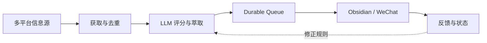

# 100X 信息研究引擎

> **A production-oriented research pipeline for turning noisy multi-source feeds into traceable knowledge.**

真正的问题不是「信息不够」，而是注意力被大量重复、低增量内容占用。100X 把获取、筛选、萃取、排队、交付与运行状态组织成一条可以长期工作的研究管线。



## 系统解决什么

- **减少噪音**：新内容先判断信息增量，不默认进入阅读队列；
- **保留证据**：任务、重试、结果和交付回执都有持久状态；
- **跨平台获取**：支持 RSS、Web、YouTube、Twitter/X、Reddit、V2EX、Hacker News、微信公众号与小宇宙等来源；
- **稳定交付**：生产控制脚本负责启动、停止、恢复、诊断与日志；
- **人与系统分工**：AI 负责获取和萃取，人决定什么值得进入长期知识系统。

## 运行结构

```text
Source Discovery
      ↓
Fetch → Normalize → Deduplicate
      ↓
Score → Extract → Route
      ↓
Durable Queue / Outbox
      ↓
Obsidian + Cindy / WeChat
      ↓
Run Log + Feedback
```

运行状态默认隔离在 `~/.100x_v3`。生产控制入口位于 `scripts/control.sh`，更底层的角色与预检命令位于 `scripts/run-v3.sh`。

## 已验证

2026-08-24 本地重新验证：

```text
332 passed in 3.40s
```

复现：

```bash
uv sync --python 3.13 --extra dev
uv run python -m compileall -q src tests scripts/v2_compare.py scripts/test_rss_fetch.py
uv run pytest -q
```

## 和 Reclaim Feed 的关系

- **100X** 是生产研究引擎：负责获取、评估、队列、状态和可靠交付；
- **[Reclaim Feed](https://github.com/bor799/reclaim-feed)** 是产品层实验：探索人怎样阅读、批注和再生产这些内容。

二者共享同一个问题，但不强行放在同一个仓库：运行可靠性和产品体验需要不同的演进节奏。

## 目录

```text
src/       核心包与运行逻辑
tests/     回归与契约测试
scripts/   控制面、运维与迁移脚本
config/    信息源与运行配置
docs/      架构、错误处理和运行手册
prompts/   评分、萃取与输出规则
```

## 边界

- 它不会替人判断什么值得相信；
- 多个相似来源不自动成为多份独立证据；
- 默认保留人工选择与最终写入权；
- 外部平台能力依赖对应抓取工具与账号环境。

## My role

我负责定义注意力问题、信息生命周期、队列与交付契约、失败恢复方式，以及什么结果才算「进入知识系统」。AI 主要承担代码实现、测试补全和文档生产。
